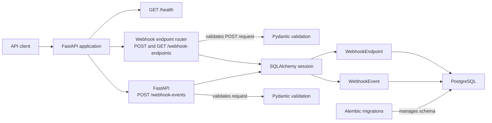

# Reliable Webhook Delivery Service

A FastAPI service being developed toward reliable webhook ingestion and delivery.

[Documentation](docs/index.md) | [Development](docs/development.md) | [Database](docs/database.md) | [API](docs/api/index.md) | [Webhook endpoints](docs/api/webhook-endpoints.md) | [Webhook events](docs/api/webhook-events.md)

## Table of contents

- [Current scope](#current-scope)
- [Planned scope](#planned-scope)
- [Non-goals](#non-goals)
- [Architecture](#architecture)
- [Technology stack](#technology-stack)
- [Quick start](#quick-start)
- [Available API](#available-api)
- [Quality checks](#quality-checks)
- [Documentation](#documentation)

## Current scope

- Python 3.12 FastAPI application with `GET /health`
- PostgreSQL persistence through synchronous SQLAlchemy sessions
- Alembic migrations and a Docker Compose PostgreSQL service
- `WebhookEndpoint` ORM model and `webhook_endpoints` table
- `POST /webhook-endpoints` and `GET /webhook-endpoints`
- Webhook event creation API through `POST /webhook-events`
- Pydantic request validation for webhook events
- PostgreSQL JSONB persistence linked to an existing `WebhookEndpoint`
- HTTP 404 response when the referenced webhook endpoint does not exist
- `WebhookDeliveryAttempt` ORM model and `webhook_delivery_attempts` PostgreSQL table
- Completed delivery attempt persistence linked to `WebhookEvent` through a foreign key
- PostgreSQL constraints for attempt number, outcome, HTTP response status, and duration
- ORM code can store completed attempts; the current API does not create them automatically
- Integration tests against real PostgreSQL
- GitHub Actions CI with Ruff and strict mypy validation

## Planned scope

The following capabilities are planned but are not currently implemented:

- Asynchronous delivery processing
- Retry and backoff
- Idempotency
- Automatic delivery attempt recording and inspection
- Manual replay

## Non-goals

- Authentication
- Frontend

## Architecture

The diagram shows only the currently implemented application path.



Detailed database and API behavior is documented separately in [Database and migrations](docs/database.md) and [API documentation](docs/api/index.md).

## Technology stack

- Python 3.12
- FastAPI
- Pydantic v2
- PostgreSQL
- Psycopg
- SQLAlchemy 2.x
- Alembic
- Docker Compose
- pytest
- Ruff
- mypy
- GitHub Actions

## Quick start

```powershell
python -m venv .venv
.\.venv\Scripts\Activate.ps1
python -m pip install -e ".[dev]"
Copy-Item .env.example .env
docker compose up -d postgres
python -m alembic upgrade head
python -m uvicorn reliable_webhook_service.main:app --reload
```

- Application: `http://127.0.0.1:8000`
- Swagger UI: `http://127.0.0.1:8000/docs`
- ReDoc: `http://127.0.0.1:8000/redoc`

See the [Development setup guide](docs/development.md) for environment configuration, PostgreSQL port conflicts, and local workflow details.

## Available API

| Method | Path | Purpose |
|---|---|---|
| GET | `/health` | Check application availability |
| POST | `/webhook-endpoints` | Create a webhook endpoint configuration |
| GET | `/webhook-endpoints` | List stored webhook endpoint configurations |
| POST | `/webhook-events` | Store an event for an existing webhook endpoint |

[API documentation](docs/api/index.md) | [Webhook endpoint API](docs/api/webhook-endpoints.md) | [Webhook event API](docs/api/webhook-events.md)

## Quality checks

```powershell
python -m pytest -W error
python -m ruff check .
python -m ruff format --check .
python -m mypy src
python -m alembic check
```

The full test suite and Alembic check require a running PostgreSQL service with migrations applied.

[Development setup](docs/development.md#quality-checks)

## Documentation

| Document | Description |
|---|---|
| [Documentation index](docs/index.md) | Main documentation portal |
| [Development setup](docs/development.md) | Local installation, configuration, PostgreSQL startup, and quality checks |
| [Database and migrations](docs/database.md) | PostgreSQL configuration, Alembic, schema, and ORM behavior |
| [API documentation](docs/api/index.md) | Available HTTP API and interactive documentation |
| [Webhook endpoint API](docs/api/webhook-endpoints.md) | Endpoint creation, validation, listing, and status codes |
| [Webhook event API](docs/api/webhook-events.md) | Event creation, validation, persistence, and error responses |
