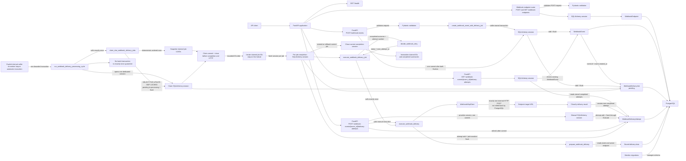

# Reliable Webhook Delivery Service

A FastAPI service being developed toward reliable webhook ingestion and delivery.

[Documentation](docs/index.md) | [Development](docs/development.md) | [Database](docs/database.md) | [Delivery execution](docs/delivery-execution.md) | [API](docs/api/index.md) | [Webhook endpoints](docs/api/webhook-endpoints.md) | [Webhook events](docs/api/webhook-events.md) | [Delivery attempts](docs/api/webhook-delivery-attempts.md)

## Table of contents

- [Current scope](#current-scope)
- [Planned scope](#planned-scope)
- [Non-goals](#non-goals)
- [Architecture](#architecture)
- [Technology stack](#technology-stack)
- [Quick start](#quick-start)
- [Available API](#available-api)
- [Quality checks](#quality-checks)
- [Documentation](#documentation)

## Current scope

- Python 3.12 FastAPI application with `GET /health`
- PostgreSQL persistence through synchronous SQLAlchemy sessions
- Alembic migrations and a Docker Compose PostgreSQL service
- `WebhookEndpoint` ORM model and `webhook_endpoints` table
- `POST /webhook-endpoints` and `GET /webhook-endpoints`
- `POST /webhook-events` validates a webhook event and atomically creates one `WebhookEvent` and
  one associated `pending` `WebhookDeliveryJob` in a caller-owned transaction
- The route commits the event and job together once; `next_attempt_at` represents the same instant
  as the server-generated `event.created_at`
- PostgreSQL JSONB event persistence linked to an existing `WebhookEndpoint`; inactive endpoints
  are accepted, while a missing endpoint returns HTTP 404 without creating either record
- The event response still contains only the event; creating its durable job does not execute HTTP,
  create a delivery attempt, invoke claiming or retry logic, or start a worker
- `WebhookDeliveryJob` ORM model and `webhook_delivery_jobs` PostgreSQL table for durable processing
  state linked to `WebhookEvent`, with at most one job per event
- Delivery job statuses: `pending`, `processing`, `succeeded`, and `dead_letter`
- Delivery job scheduling constraints require `next_attempt_at` for `pending` and `processing`, and
  require `next_attempt_at=NULL` for `succeeded` and `dead_letter`
- Database `ON DELETE CASCADE` removes a delivery job when its event is deleted
- Synchronous application service for claiming batches of due `pending` delivery jobs
- PostgreSQL `SELECT FOR UPDATE SKIP LOCKED` row-level locking with deterministic ordering by
  `next_attempt_at`, `created_at`, and `id`
- Caller-selected claim batch limit and the `pending` to `processing` state transition
- Caller-owned claim transaction: the service flushes changes but does not commit or roll back
- Real PostgreSQL tests with two independent sessions confirm locked jobs are skipped and claims do
  not overlap
- Claiming is a separate transaction that must finish before external HTTP execution begins
- `WebhookDeliveryAttempt` ORM model and `webhook_delivery_attempts` PostgreSQL table
- Completed delivery attempt persistence linked to `WebhookEvent` through a foreign key
- PostgreSQL constraints for attempt number, outcome, HTTP response status, and duration
- Synchronous `execute_webhook_delivery` execution service that uses a caller-owned transaction
- Injectable HTTP client abstraction with exactly one HTTP POST per execution
- Explicit request timeout with redirects disabled
- Delivery result classification: 2xx is `succeeded`; non-2xx and transport errors are `failed`
- The execution service creates, adds, and flushes one completed `WebhookDeliveryAttempt` with the
  next number for its event; it does not commit, roll back, or refresh
- Attempt records include the target URL snapshot, HTTP status, normalized error, duration, and
  timezone-aware attempt timestamp
- Public manual `POST /webhook-events/{event_id}/delivery-attempts` endpoint that synchronously
  executes exactly one delivery, commits once, refreshes the attempt after commit, and returns it
- Manual execution uses `execute_webhook_delivery` directly and does not update a
  `WebhookDeliveryJob`
- HTTP 201 for both committed `succeeded` and `failed` delivery attempts
- Preparation errors occur before HTTP execution and before a delivery attempt is created
- Internal, framework-independent `execute_webhook_delivery_job` validates an existing committed
  `processing` job and calls `execute_webhook_delivery` exactly once
- After the completed attempt, internal completion obtains exactly one retry decision and applies
  `processing` to `succeeded`, `pending` with the policy's exact `next_attempt_at`, or
  `dead_letter`
- The new `WebhookDeliveryAttempt` and existing `WebhookDeliveryJob` transition share one
  caller-owned completion transaction: delivery execution flushes the attempt, job completion
  flushes the transition, and the caller commits or rolls back
- Real PostgreSQL tests confirm pre-commit invisibility, joint post-commit visibility, and rollback
  of both the attempt and job transition to the previously committed `processing` state
- Configurable positive, finite `WEBHOOK_DELIVERY_TIMEOUT_SECONDS` application setting, with a
  default of 10.0 seconds
- Configurable total attempt limit and exponential-backoff base and maximum delay settings
- Pure, deterministic retry policy with no jitter that returns `pending`, `succeeded`, or
  `dead_letter` decisions and normalizes timezone-aware `next_attempt_at` values to UTC
- The retry policy is connected to internal job completion but is not invoked automatically
- Internal, synchronous `run_webhook_delivery_processing_cycle` orchestration for one explicitly
  invoked bounded batch
- One dedicated claim transaction is committed and closed before HTTP; claimed job IDs are then
  processed in deterministic order with one fresh completion transaction per job
- Each successful per-job completion is committed before the next job starts, while a failed
  current completion is rolled back and stops the cycle
- Immutable cycle results contain claimed job IDs and primitive completion summaries without ORM
  objects
- Partial progress is intentional: earlier completion commits remain durable after a later
  failure, so the cycle has no batch-level atomicity or batch rollback
- HTTP 404 for a missing event and HTTP 409 for a missing or inactive endpoint before execution
- Manual-only execution: creating a webhook event does not trigger delivery automatically
- Read-only `GET /webhook-events/{event_id}/delivery-attempts` listing stored completed attempts for
  one existing event; it returns an empty list when none exist, returns HTTP 404 for a missing
  event, and does not create or modify attempts
- Integration tests against real PostgreSQL
- GitHub Actions CI with Ruff and strict mypy validation
- No worker, polling loop, automatic cycle invocation, automatic retry execution, stale
  `processing` recovery, or public delivery-job API exists

## Planned scope

The following capabilities are planned but are not currently implemented:

- Long-running worker and polling loop
- Automatic bounded-cycle invocation
- Automatic execution of retries already scheduled as `pending`
- Stale `processing` recovery
- Idempotency
- Automatic delivery execution after event creation
- Manual replay

## Non-goals

- Authentication
- Frontend

## Architecture

The diagram shows only the currently implemented application path.


```mermaid
flowchart LR
    Client["API client"] --> App["FastAPI application"]
    App --> Health["GET /health"]
    App --> Router["Webhook endpoint router<br/>POST and GET /webhook-endpoints"]
    Router -->|"validates POST request"| Validation["Pydantic validation"]
    Router --> Session["SQLAlchemy session"]
    Session --> Endpoint["WebhookEndpoint"]
    Endpoint --> PostgreSQL["PostgreSQL"]
    App --> EventAPI["FastAPI<br/>POST /webhook-events"]
    EventAPI -->|"validates request"| EventValidation["Pydantic validation"]
    EventValidation --> EventService["create_webhook_event_with_delivery_job"]
    EventService -->|"caller-owned transaction"| EventSession["SQLAlchemy session"]
    EventSession -->|"add + flush"| Event["WebhookEvent"]
    Event -->|"event.id + event.created_at"| Job["WebhookDeliveryJob<br/>pending"]
    EventSession -->|"add + flush"| Job
    EventAPI -->|"one commit after both flushes"| EventSession
    Event --> PostgreSQL
    Job --> PostgreSQL
    App --> AttemptPOST["FastAPI<br/>POST /webhook-events/{event_id}/delivery-attempts"]
    AttemptPOST -->|"calls manual execution"| Execute["execute_webhook_delivery"]
    AttemptPOST -->|"provides session; one commit"| DeliverySession["Manual SQLAlchemy session"]
    App --> AttemptGET["FastAPI<br/>GET /webhook-events/{event_id}/delivery-attempts"]
    AttemptGET --> AttemptSession["SQLAlchemy session"]
    AttemptSession -->|"checks existing WebhookEvent"| Event
    AttemptSession -->|"reads stored completed attempts"| Attempt["WebhookDeliveryAttempt"]
    Attempt --> PostgreSQL
    Execute --> Prepare["prepare_webhook_delivery"]
    Prepare -->|"reads event and active endpoint"| DeliveryData["Stored delivery data"]
    DeliveryData --> PostgreSQL
    Execute --> HTTPClient["WebhookHttpClient"]
    HTTPClient -->|"exactly one external HTTP POST<br/>not rolled back by PostgreSQL"| Target["Endpoint target URL"]
    Target --> Classification["Classify delivery result"]
    Classification -->|"creates one completed attempt"| Attempt
    DeliverySession -->|"attempt add + flush through Execute"| Attempt
    AttemptPOST -->|"refresh after commit"| Attempt
    ExplicitCaller["Explicit internal caller<br/>no worker loop or automatic invocation"]
    ExplicitCaller -->|"one bounded invocation"| Cycle["run_webhook_delivery_processing_cycle"]
    Cycle -->|"opens one dedicated session"| ClaimSession["Claim SQLAlchemy session"]
    Cycle -->|"calls exactly once"| ClaimService["claim_due_webhook_delivery_jobs"]
    ClaimService -->|"SELECT FOR UPDATE SKIP LOCKED<br/>pending to processing + flush"| ClaimSession
    ClaimSession --> Job
    ClaimService -->|"deterministic ordered rows"| IDSnapshot["Snapshot claimed job UUIDs"]
    IDSnapshot --> ClaimEnd["Claim commit + close<br/>before completion and HTTP"]
    ClaimSession --> ClaimEnd
    ClaimEnd -->|"bounded ID order"| JobLoop["Iterate claimed job IDs<br/>stop on first failure"]
    JobLoop -->|"fresh session per job"| CompletionSession["Per-job completion SQLAlchemy session"]
    CompletionSession --> JobExecution["execute_webhook_delivery_job"]
    JobExecution -->|"calls exactly once"| Execute
    CompletionSession -->|"attempt add + job transition flush"| Attempt
    CompletionSession --> Job
    JobExecution -->|"completed outcome + attempt number"| RetryPolicy["decide_webhook_retry"]
    RetryPolicy -->|"status + next_attempt_at"| JobExecution
    CompletionSession -->|"commit or rollback current job"| CompletionEnd["Close current completion session"]
    CompletionEnd --> Result["Immutable claimed IDs<br/>and completed summaries"]
    Cycle --> Limits["No batch transaction<br/>no exactly-once guarantee"]
    Migrations["Alembic migrations"] -->|"manages schema"| PostgreSQL
```

**Event creation transaction.** The event route flushes one `WebhookEvent` and its initial
`pending` `WebhookDeliveryJob`, then commits both together. No HTTP request occurs.

**Manual attempt transaction.** The manual POST route calls `execute_webhook_delivery`, which
performs one external HTTP request and flushes one completed attempt. The route commits and
refreshes the attempt. It does not update the delivery job.

**Bounded-cycle claim transaction.** An explicit internal caller invokes
`run_webhook_delivery_processing_cycle` once. The cycle creates one claim session, calls
`claim_due_webhook_delivery_jobs` exactly once for at most `limit` due jobs, snapshots their UUIDs,
commits the `pending` to `processing` changes, and closes the claim session before completion or
HTTP begins.

**Bounded-cycle per-job completion transactions.** The cycle processes the UUID snapshot in
deterministic claim order. For each ID it creates a fresh session, calls
`execute_webhook_delivery_job` once, performs one attempt, applies one retry decision, and commits
the attempt plus job transition before closing the session and moving to the next ID. A current
failure is rolled back, its session is closed, and later claimed jobs are not started.

The complete bounded sequence is:

1. create the claim session;
2. claim at most `limit` due `pending` jobs;
3. commit and close the claim transaction;
4. retain only the ordered job IDs;
5. create a fresh completion session for the next ID;
6. perform one attempt;
7. apply the retry policy;
8. commit or roll back the current completion;
9. close the current session;
10. continue only after a successful completion commit.

The cycle returns immutable snapshots of claimed IDs and completed job values rather than ORM
objects. If job A commits and job B later fails, A remains completed, B's current completion is
rolled back, and B plus any later claimed jobs remain `processing` because the claim transaction
was already committed. There is no batch-level atomicity, batch rollback, or automatic recovery
for these stale `processing` jobs.

The external HTTP request is not part of the PostgreSQL transaction. A rollback cannot undo an
HTTP request that already reached the target, so exactly-once delivery is not guaranteed. Detailed
behavior is documented in [Database and migrations](docs/database.md), [Webhook delivery
execution](docs/delivery-execution.md), and [API documentation](docs/api/index.md).

The bounded cycle is an internal service and runs only when called explicitly. It is not a worker,
background task, polling loop, scheduler, or automatic retry executor, and it does not invoke
another cycle by itself.

## Technology stack

- Python 3.12
- FastAPI
- Pydantic v2
- httpx2, used as the synchronous HTTP client for one webhook delivery
- PostgreSQL
- Psycopg
- SQLAlchemy 2.x
- Alembic
- Docker Compose
- pytest
- Ruff
- mypy
- GitHub Actions

## Quick start

```powershell
python -m venv .venv
.\.venv\Scripts\Activate.ps1
python -m pip install -e ".[dev]"
Copy-Item .env.example .env
docker compose up -d postgres
python -m alembic upgrade head
python -m uvicorn reliable_webhook_service.main:app --reload
```

- Application: `http://127.0.0.1:8000`
- Swagger UI: `http://127.0.0.1:8000/docs`
- ReDoc: `http://127.0.0.1:8000/redoc`

See the [Development setup guide](docs/development.md) for environment configuration, PostgreSQL port conflicts, and local workflow details.

## Available API

| Method | Path | Purpose |
|---|---|---|
| GET | `/health` | Check application availability |
| POST | `/webhook-endpoints` | Create a webhook endpoint configuration |
| GET | `/webhook-endpoints` | List stored webhook endpoint configurations |
| POST | `/webhook-events` | Store an event and atomically create its pending delivery job |
| POST | `/webhook-events/{event_id}/delivery-attempts` | Manually execute one synchronous delivery and return the persisted attempt |
| GET | `/webhook-events/{event_id}/delivery-attempts` | List stored completed delivery attempts for one event |

The pending job is a durable work item and is not included in the event response. Manual delivery
remains explicit: `POST /webhook-events` does not invoke the delivery endpoint or execute HTTP
automatically.

[API documentation](docs/api/index.md) | [Webhook endpoint API](docs/api/webhook-endpoints.md) | [Webhook event API](docs/api/webhook-events.md) | [Webhook delivery attempt API](docs/api/webhook-delivery-attempts.md)

## Quality checks

```powershell
python -m pytest -W error
python -m ruff check .
python -m ruff format --check .
python -m mypy src
python -m alembic check
```

The full test suite and Alembic check require a running PostgreSQL service with migrations applied.

[Development setup](docs/development.md#quality-checks)

## Documentation

| Document | Description |
|---|---|
| [Documentation index](docs/index.md) | Main documentation portal |
| [Development setup](docs/development.md) | Local installation, configuration, PostgreSQL startup, and quality checks |
| [Database and migrations](docs/database.md) | PostgreSQL configuration, Alembic, schema, atomic event and job persistence, claiming, and `SKIP LOCKED` transaction semantics |
| [Webhook delivery execution](docs/delivery-execution.md) | Manual execution, the explicit bounded processing cycle, per-job completion, partial progress, retry decisions, transaction boundaries, and limitations |
| [API documentation](docs/api/index.md) | Available HTTP API and interactive documentation |
| [Webhook endpoint API](docs/api/webhook-endpoints.md) | Endpoint creation, validation, listing, and status codes |
| [Webhook event API](docs/api/webhook-events.md) | Event creation, validation, persistence, and error responses |
| [Webhook delivery attempt API](docs/api/webhook-delivery-attempts.md) | Manual execution POST, persisted outcomes, preparation errors, and read-only GET listing |
