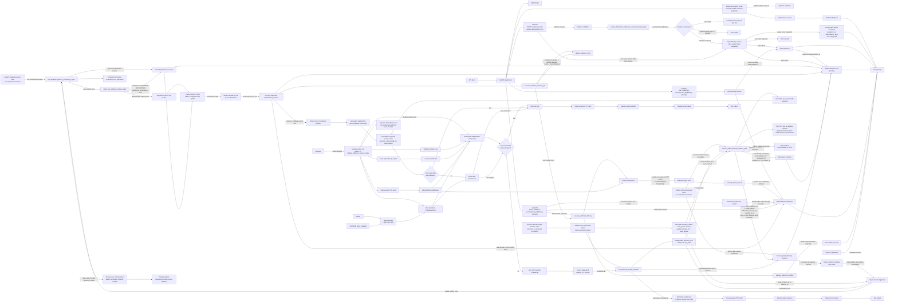

# Reliable Webhook Delivery Service

A FastAPI service being developed toward reliable webhook ingestion and delivery.

[Documentation](docs/index.md) | [Development](docs/development.md) | [Database](docs/database.md) | [Delivery execution](docs/delivery-execution.md) | [API](docs/api/index.md) | [Webhook endpoints](docs/api/webhook-endpoints.md) | [Webhook events](docs/api/webhook-events.md) | [Delivery attempts](docs/api/webhook-delivery-attempts.md)

## Table of contents

- [Current scope](#current-scope)
- [Planned scope](#planned-scope)
- [Non-goals](#non-goals)
- [Architecture](#architecture)
- [Technology stack](#technology-stack)
- [Quick start](#quick-start)
- [Worker configuration](#worker-configuration)
- [Run the worker](#run-the-worker)
- [Available API](#available-api)
- [Quality checks](#quality-checks)
- [Documentation](#documentation)

## Current scope

- Python 3.12 FastAPI application with `GET /health`
- PostgreSQL persistence through synchronous SQLAlchemy sessions
- Alembic migrations and a Docker Compose PostgreSQL service
- `WebhookEndpoint` ORM model and `webhook_endpoints` table
- `POST /webhook-endpoints` and `GET /webhook-endpoints`
- `POST /webhook-events` validates a webhook event and atomically creates one `WebhookEvent` and
  one associated `pending` `WebhookDeliveryJob` in a caller-owned transaction
- `POST /webhook-events` accepts an optional endpoint-scoped `Idempotency-Key` header. A new
  request returns HTTP 201; an equivalent keyed retry returns the existing event with HTTP 200;
  conflicting reuse returns HTTP 409; and an invalid key returns HTTP 422
- Event-ingestion idempotency uses the unique `(endpoint_id, idempotency_key)` scope, a
  PostgreSQL-backed race safeguard, and atomic event-plus-job creation. The public response remains
  event-only and does not expose the key or an internal `created` flag
- Event-ingestion idempotency does not provide downstream delivery idempotency or exactly-once
  delivery; the service does not forward `Idempotency-Key` to the target
- The route commits the event and job together once; `next_attempt_at` represents the same instant
  as the server-generated `event.created_at`
- PostgreSQL JSONB event persistence linked to an existing `WebhookEndpoint`; inactive endpoints
  are accepted, while a missing endpoint returns HTTP 404 without creating either record
- The event response still contains only the event; creating its durable job does not execute HTTP,
  create a delivery attempt, invoke claiming or retry logic, or invoke the bounded worker
  iteration
- `WebhookDeliveryJob` ORM model and `webhook_delivery_jobs` PostgreSQL table for durable processing
  state linked to `WebhookEvent`, with at most one job per event
- Delivery job statuses: `pending`, `processing`, `succeeded`, and `dead_letter`
- Delivery job scheduling constraints require `next_attempt_at` for `pending` and `processing`, and
  require `next_attempt_at=NULL` for `succeeded` and `dead_letter`
- Database `ON DELETE CASCADE` removes a delivery job when its event is deleted
- Synchronous application service for claiming batches of due `pending` delivery jobs
- PostgreSQL `SELECT FOR UPDATE SKIP LOCKED` row-level locking with deterministic ordering by
  `next_attempt_at`, `created_at`, and `id`
- Caller-selected claim batch limit and the `pending` to `processing` state transition
- Caller-owned claim transaction: the service flushes changes but does not commit or roll back
- Real PostgreSQL tests with two independent sessions confirm locked jobs are skipped and claims do
  not overlap
- Claiming is a separate transaction that must finish before external HTTP execution begins
- `WebhookDeliveryAttempt` ORM model and `webhook_delivery_attempts` PostgreSQL table
- Completed delivery attempt persistence linked to `WebhookEvent` through a foreign key
- PostgreSQL constraints for attempt number, outcome, HTTP response status, and duration
- Synchronous `execute_webhook_delivery` execution service that uses a caller-owned transaction
- Injectable HTTP client abstraction with exactly one HTTP POST per execution
- Explicit request timeout with redirects disabled
- Delivery result classification: 2xx is `succeeded`; non-2xx and transport errors are `failed`
- The execution service creates, adds, and flushes one completed `WebhookDeliveryAttempt` with the
  next number for its event; it does not commit, roll back, or refresh
- Attempt records include the target URL snapshot, HTTP status, normalized error, duration, and
  timezone-aware attempt timestamp
- Public manual `POST /webhook-events/{event_id}/delivery-attempts` endpoint that synchronously
  executes exactly one delivery, commits once, refreshes the attempt after commit, and returns it
- Manual execution uses `execute_webhook_delivery` directly and does not update a
  `WebhookDeliveryJob`
- HTTP 201 for both committed `succeeded` and `failed` delivery attempts
- Preparation errors occur before HTTP execution and before a delivery attempt is created
- Internal, framework-independent `execute_webhook_delivery_job` validates an existing committed
  `processing` job and calls `execute_webhook_delivery` exactly once
- After the completed attempt, internal completion obtains exactly one retry decision and applies
  `processing` to `succeeded`, `pending` with the policy's exact `next_attempt_at`, or
  `dead_letter`
- The new `WebhookDeliveryAttempt` and existing `WebhookDeliveryJob` transition share one
  caller-owned completion transaction: delivery execution flushes the attempt, job completion
  flushes the transition, and the caller commits or rolls back
- Real PostgreSQL tests confirm pre-commit invisibility, joint post-commit visibility, and rollback
  of both the attempt and job transition to the previously committed `processing` state
- Configurable positive, finite `WEBHOOK_DELIVERY_TIMEOUT_SECONDS` application setting, with a
  default of 10.0 seconds
- Configurable total attempt limit and exponential-backoff base and maximum delay settings
- Pure, deterministic retry policy with no jitter that returns `pending`, `succeeded`, or
  `dead_letter` decisions and normalizes timezone-aware `next_attempt_at` values to UTC
- The retry policy is connected to internal job completion; a running worker can execute a
  scheduled retry in a later iteration after `next_attempt_at` becomes due
- Internal, synchronous `run_webhook_delivery_processing_cycle` orchestration for one explicitly
  invoked bounded batch
- One dedicated claim transaction is committed and closed before HTTP; claimed job IDs are then
  processed in deterministic order with one fresh completion transaction per job
- Each successful per-job completion is committed before the next job starts, while a failed
  current completion is rolled back and stops the cycle
- Immutable cycle results contain claimed job IDs and primitive completion summaries without ORM
  objects
- Partial progress is intentional: earlier completion commits remain durable after a later
  failure, so the cycle has no batch-level atomicity or batch rollback
- Internal, synchronous `recover_stale_webhook_delivery_jobs` service for one explicitly invoked
  bounded recovery batch
- Recovery selects `processing` jobs with `updated_at <= stale_before` in deterministic
  `updated_at`, `created_at`, and `id` order through `FOR UPDATE SKIP LOCKED`
- Recovery changes selected jobs from `processing` to `pending`, sets both `next_attempt_at` and
  `updated_at` to the normalized `recovered_at`, and flushes without creating attempts or HTTP
- The caller owns recovery commit or rollback, while the immutable result contains only recovered
  job UUIDs
- Internal, synchronous `run_webhook_worker_iteration` service for one explicitly invoked bounded
  worker iteration: one stale-job recovery batch followed by exactly one bounded processing cycle
- Worker-iteration validation finishes before a session is created; a dedicated recovery session
  commits and closes before the processing phase creates its own sessions or performs HTTP
- The same normalized `iteration_at` is passed as recovery `recovered_at` and processing
  `claimed_at`, so a recovered job is eligible for the claim phase of the same iteration
- Independent `recovery_limit` and `processing_limit` values bound the two phases separately
- The immutable composed worker result embeds the lower-level recovery and processing results,
  exposes their derived counts, and contains no ORM objects or mutable collections
- Recovery and processing are separate transaction boundaries: a processing failure cannot undo
  the durable recovery commit, earlier per-job completion commits remain durable, and there is no
  iteration-wide transaction or batch rollback
- Framework-independent synchronous worker loop that repeatedly invokes the existing one-shot
  worker iteration without duplicating recovery, processing, completion, or retry logic
- Runnable worker CLI through `python -m reliable_webhook_service.worker`; importing the module
  does not start execution
- Environment-driven worker settings for the poll interval, stale-processing timeout, recovery
  batch limit, and processing batch limit
- The first iteration starts without a preceding wait; successful later iterations are separated
  by `threading.Event.wait` for the poll interval
- Every iteration performs stale recovery before processing. While the worker runs, it claims due
  pending jobs and executes scheduled retries in later iterations after they become due
- The API process and long-running worker process are separate explicitly started processes.
  Event creation and FastAPI startup do not start or control the worker
- The worker process creates and owns a local engine and local session factory rather than using
  the application's global `SessionFactory`
- One shared HTTP client is reused across iterations and closed when the worker exits
- One shutdown `threading.Event` is set by handlers for `SIGINT` and, where available, `SIGTERM`
- Graceful shutdown finishes the active one-shot worker iteration, starts no next iteration,
  restores previous signal handlers, closes the HTTP client, and calls `engine.dispose()`
- Normal shutdown maps to exit code `0`; an unhandled ordinary fatal error maps to exit code `1`
  without an immediate worker-level retry
- Lifecycle logging reports safe aggregate state without payloads, secrets, or full response
  bodies
- The API process serves HTTP; the long-running worker process owns runtime resources; its worker
  loop controls polling; each one-shot worker iteration performs a recovery phase followed by one
  processing cycle; each claimed job uses its own completion transaction
- HTTP 404 for a missing event and HTTP 409 for a missing or inactive endpoint before execution
- Event-creation boundary: creating a webhook event persists work but does not execute delivery
  within the API request
- Read-only `GET /webhook-events/{event_id}/delivery-attempts` listing stored completed attempts for
  one existing event; it returns an empty list when none exist, returns HTTP 404 for a missing
  event, and does not create or modify attempts
- Integration tests against real PostgreSQL
- GitHub Actions CI with Ruff and strict mypy validation
- The bounded worker iteration remains a one-shot internal service even when repeated by the
  long-running worker loop; no public delivery-job or worker-lifecycle API exists

## Planned scope

The following capabilities are planned but are not currently implemented:

- Automatic worker startup with the API or through FastAPI lifespan
- Scheduler-managed deployments and cron integration
- Operating-system service files, including systemd units and a Windows service
- Kubernetes manifests and cloud deployment
- Coordination of multiple workers, distributed leader election, leases, lease ownership, and
  heartbeat
- Parallel delivery completion
- Configurable worker-level retry after a fatal iteration failure
- Remote delivery verification
- Downstream delivery idempotency and remote-side deduplication
- Idempotency-key expiration, deletion, or automatic cleanup
- Exactly-once delivery
- Direct delivery execution inside the event-creation API request
- Manual replay

## Non-goals

- Authentication
- Frontend

## Architecture

The diagram shows the implemented API, one-shot orchestration, and explicitly started worker
process paths.


```mermaid
flowchart LR
    Client["API client"] --> App["FastAPI application"]
    App --> Health["GET /health"]
    App --> Router["Webhook endpoint router<br/>POST and GET /webhook-endpoints"]
    Router -->|"validates POST request"| Validation["Pydantic validation"]
    Router --> Session["SQLAlchemy session"]
    Session --> Endpoint["WebhookEndpoint"]
    Endpoint --> PostgreSQL["PostgreSQL"]
    App --> EventAPI["FastAPI<br/>POST /webhook-events<br/>optional Idempotency-Key"]
    EventAPI -->|"validates request"| EventValidation["Pydantic validation"]
    EventValidation --> EventService["create_idempotent_webhook_event_with_delivery_job"]
    EventService -->|"pre-insert scoped lookup"| ExistingKey{"Existing scoped key?"}
    ExistingKey -->|"equivalent"| ReusedEvent["Existing event response<br/>200 OK"]
    ExistingKey -->|"different event type or payload"| EventConflict["409 Conflict"]
    ExistingKey -->|"new key or no key"| EventSession["SQLAlchemy session<br/>caller-owned outer transaction"]
    EventSession -->|"add + flush"| Event["WebhookEvent"]
    Event -->|"event.id + event.created_at"| Job["WebhookDeliveryJob<br/>pending"]
    EventSession -->|"add + flush"| Job
    EventSession -->|"keyed insert savepoint"| EventKeyConstraint["PostgreSQL unique constraint<br/>(endpoint_id, idempotency_key)<br/>race safeguard"]
    EventKeyConstraint --> PostgreSQL
    EventAPI -->|"one outer commit after both flushes"| EventSession
    EventSession -->|"new event response"| CreatedEvent["201 Created"]
    Event --> PostgreSQL
    Job --> PostgreSQL
    App --> AttemptPOST["FastAPI<br/>POST /webhook-events/{event_id}/delivery-attempts"]
    AttemptPOST -->|"calls manual execution"| Execute["execute_webhook_delivery"]
    AttemptPOST -->|"provides session; one commit"| DeliverySession["Manual SQLAlchemy session"]
    App --> AttemptGET["FastAPI<br/>GET /webhook-events/{event_id}/delivery-attempts"]
    AttemptGET --> AttemptSession["SQLAlchemy session"]
    AttemptSession -->|"checks existing WebhookEvent"| Event
    AttemptSession -->|"reads stored completed attempts"| Attempt["WebhookDeliveryAttempt"]
    Attempt --> PostgreSQL
    Execute --> Prepare["prepare_webhook_delivery"]
    Prepare -->|"reads event and active endpoint"| DeliveryData["Stored delivery data"]
    DeliveryData --> PostgreSQL
    Execute --> HTTPClient["WebhookHttpClient"]
    HTTPClient -->|"exactly one external HTTP POST<br/>not rolled back by PostgreSQL"| Target["Endpoint target URL"]
    Target --> Classification["Classify delivery result"]
    Classification -->|"creates one completed attempt"| Attempt
    DeliverySession -->|"attempt add + flush through Execute"| Attempt
    AttemptPOST -->|"refresh after commit"| Attempt
    ExplicitCaller["Explicit standalone cycle caller<br/>no automatic invocation"]
    ExplicitCaller -->|"one bounded invocation"| Cycle["run_webhook_delivery_processing_cycle"]
    Cycle -->|"opens one dedicated session"| ClaimSession["Claim SQLAlchemy session"]
    Cycle -->|"calls exactly once"| ClaimService["claim_due_webhook_delivery_jobs"]
    ClaimService -->|"SELECT FOR UPDATE SKIP LOCKED<br/>pending to processing + flush"| ClaimSession
    ClaimSession --> Job
    ClaimService -->|"deterministic ordered rows"| IDSnapshot["Snapshot claimed job UUIDs"]
    IDSnapshot --> ClaimEnd["Claim commit + close<br/>before completion and HTTP"]
    ClaimSession --> ClaimEnd
    ClaimEnd -->|"bounded ID order"| JobLoop["Iterate claimed job IDs<br/>stop on first failure"]
    JobLoop -->|"fresh session per job"| CompletionSession["Per-job completion SQLAlchemy session"]
    CompletionSession --> JobExecution["execute_webhook_delivery_job"]
    JobExecution -->|"calls exactly once"| Execute
    CompletionSession -->|"attempt add + job transition flush"| Attempt
    CompletionSession --> Job
    JobExecution -->|"completed outcome + attempt number"| RetryPolicy["decide_webhook_retry"]
    RetryPolicy -->|"status + next_attempt_at"| JobExecution
    CompletionSession -->|"commit or rollback current job"| CompletionEnd["Close current completion session"]
    CompletionEnd --> Result["Immutable claimed IDs<br/>and completed summaries"]
    Cycle --> Limits["No batch transaction<br/>no exactly-once guarantee"]
    RecoveryCaller["Explicit internal recovery caller<br/>no automatic invocation"] -->|"one bounded recovery invocation"| RecoveryService["recover_stale_webhook_delivery_jobs"]
    RecoveryCaller -->|"opens caller-owned transaction"| RecoverySession["Recovery SQLAlchemy session"]
    RecoveryService -->|"processing + updated_at &lt;= stale_before<br/>ordered by updated_at, created_at, id<br/>limit + FOR UPDATE SKIP LOCKED"| RecoverySession
    RecoverySession --> Job
    RecoveryService -->|"processing to pending<br/>next_attempt_at = recovered_at<br/>updated_at = recovered_at"| RecoveryTransition["Recovered job state"]
    RecoveryTransition --> Job
    RecoverySession -->|"one flush; no internal commit"| RecoveryEnd["Caller commit or rollback<br/>then close"]
    RecoveryService --> RecoveryIDs["Immutable recovered UUID snapshot"]
    RecoveryService --> RecoveryNoIO["No HTTP and no attempt creation<br/>duplicate-delivery risk if earlier HTTP was uncertain"]
    WorkerCaller["Explicit internal worker-iteration caller<br/>one-shot; no automatic invocation"]
    WorkerCaller --> WorkerValidation["Validate all orchestration inputs<br/>before session creation"]
    WorkerValidation --> WorkerIteration["run_webhook_worker_iteration"]
    WorkerValidation --> WorkerTime["Normalize iteration_at and stale_before to UTC<br/>require iteration_at >= stale_before"]
    WorkerIteration --> WorkerLimits["Independent recovery_limit<br/>and processing_limit"]
    WorkerIteration -->|"open dedicated recovery session"| RecoverySession
    WorkerLimits -->|"recovery_limit"| RecoveryService
    WorkerTime -->|"same iteration_at as recovered_at"| RecoveryService
    RecoveryEnd -->|"commit then close before processing"| WorkerProcessing["Begin processing phase"]
    WorkerTime -->|"same iteration_at as claimed_at"| WorkerProcessing
    WorkerLimits -->|"processing_limit"| WorkerProcessing
    WorkerProcessing -->|"invoke exactly once"| Cycle
    RecoveryService -->|"failure: rollback and close"| WorkerRecoveryFailure["Stop iteration<br/>no processing or HTTP"]
    RecoveryIDs --> WorkerResult["Immutable composed worker result<br/>recovery + processing; no ORM objects"]
    Result --> WorkerResult
    Cycle -->|"failure after durable recovery commit"| WorkerPartial["No recovery compensation<br/>earlier completion commits remain"]
    WorkerPartial --> WorkerDuplicate["Partial progress<br/>possible duplicate remote delivery"]
    Operator["Operator"] -->|"starts explicitly"| WorkerCLI["Module worker CLI<br/>python -m reliable_webhook_service.worker"]
    WorkerCLI --> WorkerSettings["Settings created once"]
    WorkerCLI --> LocalEngine["Local SQLAlchemy engine"]
    LocalEngine --> LocalSessionFactory["Local sessionmaker"]
    WorkerCLI --> SharedRawHTTP["Shared raw HTTP client"]
    SharedRawHTTP --> HTTPWrapper["Httpx2WebhookHttpClient"]
    HTTPWrapper --> HTTPClient
    WorkerCLI --> ShutdownEvent["One shutdown threading.Event"]
    SIGINT["SIGINT"] --> SignalHandler["Signal handler<br/>sets Event only"]
    SIGTERM["SIGTERM when available"] --> SignalHandler
    SignalHandler --> ShutdownEvent
    WorkerCLI -->|"invokes exactly once"| WorkerLoop["Framework-independent worker loop"]
    WorkerSettings --> WorkerLoop
    LocalSessionFactory --> WorkerLoop
    HTTPWrapper --> WorkerLoop
    ShutdownEvent --> WorkerLoop
    WorkerLoop --> StopBefore{"Stop requested<br/>before iteration?"}
    StopBefore -->|"no"| IterationTimestamp["One UTC iteration timestamp"]
    IterationTimestamp --> StaleCutoff["Derive stale cutoff<br/>iteration_at - timeout"]
    StaleCutoff -->|"one-shot call"| WorkerIteration
    WorkerResult --> StopAfter{"Stop requested<br/>after iteration?"}
    StopAfter -->|"no"| PollWait["Event.wait<br/>poll interval"]
    ShutdownEvent --> PollWait
    PollWait -->|"not stopped"| StopBefore
    StopBefore -->|"yes"| GracefulStop["Graceful stop"]
    StopAfter -->|"yes"| GracefulStop
    PollWait -->|"stop requested"| GracefulStop
    GracefulStop --> NormalClose["Close shared HTTP client"]
    NormalClose --> NormalRestore["Restore signal handlers"]
    NormalRestore --> NormalDispose["Dispose local engine"]
    NormalDispose --> ExitZero["Exit code 0"]
    WorkerIteration -->|"fatal ordinary Exception"| FatalStop["Terminate worker loop<br/>no wait or worker-level retry"]
    FatalStop --> FatalClose["Close shared HTTP client"]
    FatalClose --> FatalRestore["Restore signal handlers"]
    FatalRestore --> FatalDispose["Dispose local engine"]
    FatalDispose --> ExitOne["Exit code 1"]
    WorkerCLI --> WorkerBoundary["Separate from API process<br/>not started by FastAPI or event creation"]
    Migrations["Alembic migrations"] -->|"manages schema"| PostgreSQL
```

**Event creation transaction.** The event route flushes one `WebhookEvent` and its initial
`pending` `WebhookDeliveryJob`, then commits both together. No HTTP request occurs.

**Manual attempt transaction.** The manual POST route calls `execute_webhook_delivery`, which
performs one external HTTP request and flushes one completed attempt. The route commits and
refreshes the attempt. It does not update the delivery job.

**Bounded-cycle claim transaction.** An explicit internal caller invokes
`run_webhook_delivery_processing_cycle` once. The cycle creates one claim session, calls
`claim_due_webhook_delivery_jobs` exactly once for at most `limit` due jobs, snapshots their UUIDs,
commits the `pending` to `processing` changes, and closes the claim session before completion or
HTTP begins.

**Bounded-cycle per-job completion transactions.** The cycle processes the UUID snapshot in
deterministic claim order. For each ID it creates a fresh session, calls
`execute_webhook_delivery_job` once, performs one attempt, applies one retry decision, and commits
the attempt plus job transition before closing the session and moving to the next ID. A current
failure is rolled back, its session is closed, and later claimed jobs are not started.

**Stale-job recovery transaction.** An explicit internal caller opens one session and transaction,
then calls `recover_stale_webhook_delivery_jobs` with `stale_before`, `recovered_at`, and `limit`.
The service selects one bounded batch of stale `processing` jobs through deterministic
`FOR UPDATE SKIP LOCKED`, changes them to `pending`, sets `next_attempt_at` and `updated_at` to
`recovered_at`, performs one flush, and returns an immutable UUID snapshot. It does not commit,
roll back, or close the session. The caller commits the entire batch or rolls it back, then closes
the session. A standalone recovery call requires a later explicit processing-cycle invocation;
the bounded worker iteration can instead provide that recovery-before-processing sequence in one
explicit orchestration call. The running worker invokes that one-shot orchestration on successive
polls.

**Bounded worker-iteration orchestration.** An explicit internal caller invokes
`run_webhook_worker_iteration` once. The service validates every orchestration argument before
creating a session, normalizes `iteration_at` and `stale_before` to UTC, and requires
`iteration_at >= stale_before`. It opens one dedicated recovery session, invokes one recovery batch
with `recovery_limit`, commits or rolls back that transaction, and closes the session. Only after a
successful recovery commit and close does it invoke exactly one bounded processing cycle with the
independent `processing_limit`. The same normalized `iteration_at` is used as recovery
`recovered_at` and processing `claimed_at`.

The processing cycle owns its separate claim session and fresh per-job completion sessions. The
recovery session and its row locks therefore do not remain active during HTTP. Recovery and
processing are not one transaction: a processing failure cannot roll back the durable recovery
commit, and a later per-job failure cannot roll back earlier completion commits. The worker
iteration performs no batch rollback or recovery compensation. Its immutable composed result
contains the exact recovery and processing results and derives `recovered_count`, `claimed_count`,
and `completed_count` without storing ORM objects.

The standalone bounded processing-cycle sequence is:

1. create the claim session;
2. claim at most `limit` due `pending` jobs;
3. commit and close the claim transaction;
4. retain only the ordered job IDs;
5. create a fresh completion session for the next ID;
6. perform one attempt;
7. apply the retry policy;
8. commit or roll back the current completion;
9. close the current session;
10. continue only after a successful completion commit.

The cycle returns immutable snapshots of claimed IDs and completed job values rather than ORM
objects. If job A commits and job B later fails, A remains completed, B's current completion is
rolled back, and B plus any later claimed jobs remain `processing` because the claim transaction
was already committed. There is no batch-level atomicity or batch rollback. The explicit recovery
service can later return sufficiently old `processing` jobs to `pending`; the running worker
invokes recovery before processing in every later iteration.

The external HTTP request is not part of the PostgreSQL transaction. A rollback cannot undo an
HTTP request that already reached the target. If that request succeeded remotely but completion
was not committed, recovery followed by a later processing cycle can send the webhook again.
Recovery performs no remote verification and creates no missing attempt, so downstream delivery
idempotency and exactly-once delivery are not guaranteed. Detailed behavior is documented in [Database and
migrations](docs/database.md), [Webhook delivery execution](docs/delivery-execution.md), and [API
documentation](docs/api/index.md).

**Long-running worker process.** An operator starts the worker CLI separately from the API. The
CLI creates `Settings`, a local engine and session factory, a shared HTTP client, and a shutdown
Event. The framework-independent worker loop begins without an initial wait, then repeatedly
derives one iteration timestamp and stale cutoff, invokes the one-shot worker iteration, and waits
for the poll interval. `SIGINT` or supported `SIGTERM` requests graceful shutdown. Cleanup closes
the client, restores handlers, and disposes the engine.

The standalone bounded cycle and one-shot bounded worker iteration remain independently callable
internal services. They do not schedule themselves or start from FastAPI. The worker loop supplies
the repetition only while the separate process is explicitly running.

## Technology stack

- Python 3.12
- FastAPI
- Pydantic v2
- httpx2, used as the synchronous HTTP client for one webhook delivery
- PostgreSQL
- Psycopg
- SQLAlchemy 2.x
- Alembic
- Docker Compose
- pytest
- Ruff
- mypy
- GitHub Actions

## Quick start

```powershell
python -m venv .venv
.\.venv\Scripts\Activate.ps1
python -m pip install -e ".[dev]"
Copy-Item .env.example .env
docker compose up -d postgres
python -m alembic upgrade head
python -m uvicorn reliable_webhook_service.main:app --reload
```

- Application: `http://127.0.0.1:8000`
- Swagger UI: `http://127.0.0.1:8000/docs`
- ReDoc: `http://127.0.0.1:8000/redoc`

See the [Development setup guide](docs/development.md) for environment configuration, PostgreSQL port conflicts, and local workflow details.

## Worker configuration

The API, worker CLI, Alembic, and tests read the same optional `.env` file through `Settings`.

| Setting | Default | Meaning |
|---|---:|---|
| `DATABASE_URL` | Local PostgreSQL URL from `.env.example` | PostgreSQL connection used by the process |
| `WEBHOOK_DELIVERY_TIMEOUT_SECONDS` | `10.0` | Timeout for one outgoing HTTP request |
| `WEBHOOK_DELIVERY_MAX_ATTEMPTS` | `5` | Total allowed attempts, including the first |
| `WEBHOOK_DELIVERY_RETRY_BASE_SECONDS` | `5.0` | Exponential-backoff base delay |
| `WEBHOOK_DELIVERY_RETRY_MAX_SECONDS` | `300.0` | Maximum retry delay |
| `WEBHOOK_WORKER_POLL_INTERVAL_SECONDS` | `1.0` | Wait between completed one-shot worker iterations |
| `WEBHOOK_WORKER_STALE_PROCESSING_TIMEOUT_SECONDS` | `300.0` | Age used to derive the stale recovery cutoff |
| `WEBHOOK_WORKER_RECOVERY_LIMIT` | `100` | Maximum stale jobs recovered in one iteration |
| `WEBHOOK_WORKER_PROCESSING_LIMIT` | `100` | Maximum due pending jobs claimed in one processing cycle |

The first iteration has no preceding wait. Later successful iterations wait for the poll interval.
For each iteration, `stale_before = iteration_at - stale-processing timeout`. Recovery and
processing limits are independent. Time values must be positive and finite, limits must be
positive integers, and Boolean values are not accepted as numbers.

## Run the worker

Ensure PostgreSQL is reachable and migrations are current, then use explicit operator invocation:

```powershell
python -m reliable_webhook_service.worker
```

The worker runs until graceful shutdown or a fatal error. It is not started by Uvicorn, FastAPI
lifespan, or event creation. `POST /webhook-events` only persists an event and initial pending job;
a running worker polls and claims due jobs in subsequent iterations. Run the API and worker in
separate processes when both are needed.

During shutdown, `SIGINT` or supported `SIGTERM` sets the stop Event. An active iteration finishes,
no next iteration starts, the shared HTTP client closes, signal handlers are restored, and the
local engine is disposed. A fatal iteration failure ends the process with code `1` and no
worker-level retry; normal shutdown exits with code `0`.

## Available API

| Method | Path | Purpose |
|---|---|---|
| GET | `/health` | Check application availability |
| POST | `/webhook-endpoints` | Create a webhook endpoint configuration |
| GET | `/webhook-endpoints` | List stored webhook endpoint configurations |
| POST | `/webhook-events` | Create an event and pending job, optionally reusing an equivalent event through `Idempotency-Key` (`201`, `200`, `409`, or `422`) |
| POST | `/webhook-events/{event_id}/delivery-attempts` | Manually execute one synchronous delivery and return the persisted attempt |
| GET | `/webhook-events/{event_id}/delivery-attempts` | List stored completed delivery attempts for one event |

The optional `Idempotency-Key` header is endpoint-scoped. A new event returns HTTP 201, while an
equivalent keyed retry returns the same event with HTTP 200 and creates no second job. Conflicting
reuse returns HTTP 409, and an invalid key returns HTTP 422. Both successful statuses use the same
event-only response schema; the key and job are not returned. Manual delivery remains explicit:
`POST /webhook-events` does not invoke the delivery endpoint or execute HTTP inside the API
request. An explicitly started worker process can later claim the due job.

[API documentation](docs/api/index.md) | [Webhook endpoint API](docs/api/webhook-endpoints.md) | [Webhook event API](docs/api/webhook-events.md) | [Webhook delivery attempt API](docs/api/webhook-delivery-attempts.md)

## Quality checks

```powershell
python -m pytest -W error
python -m ruff check .
python -m ruff format --check .
python -m mypy src
python -m alembic check
```

The full test suite and Alembic check require a running PostgreSQL service with migrations applied.

[Development setup](docs/development.md#quality-checks)

## Documentation

| Document | Description |
|---|---|
| [Documentation index](docs/index.md) | Main documentation portal |
| [Development setup](docs/development.md) | Local installation, configuration, PostgreSQL startup, worker startup, and quality checks |
| [Database and migrations](docs/database.md) | PostgreSQL configuration, Alembic, schema, atomic event and job persistence, worker resource ownership, claiming, recovery, bounded worker-iteration orchestration, and `SKIP LOCKED` transaction semantics |
| [Webhook delivery execution](docs/delivery-execution.md) | The [long-running worker process](docs/delivery-execution.md#long-running-worker-process), manual execution, the [bounded worker iteration](docs/delivery-execution.md#bounded-worker-iteration), polling, graceful shutdown, recovery and processing, partial progress, duplicate-delivery risk, and transaction boundaries |
| [API documentation](docs/api/index.md) | Available HTTP API and interactive documentation |
| [Webhook endpoint API](docs/api/webhook-endpoints.md) | Endpoint creation, validation, listing, and status codes |
| [Webhook event API](docs/api/webhook-events.md) | Event creation, validation, persistence, and error responses |
| [Webhook delivery attempt API](docs/api/webhook-delivery-attempts.md) | Manual execution POST, persisted outcomes, preparation errors, and read-only GET listing |
