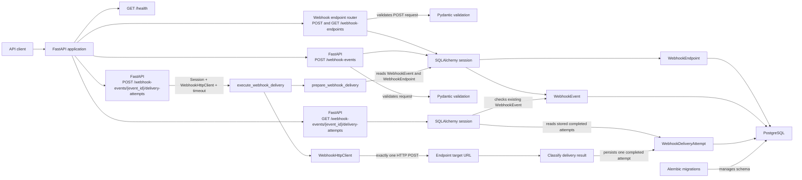

# Reliable Webhook Delivery Service

A FastAPI service being developed toward reliable webhook ingestion and delivery.

[Documentation](docs/index.md) | [Development](docs/development.md) | [Database](docs/database.md) | [Delivery execution](docs/delivery-execution.md) | [API](docs/api/index.md) | [Webhook endpoints](docs/api/webhook-endpoints.md) | [Webhook events](docs/api/webhook-events.md) | [Delivery attempts](docs/api/webhook-delivery-attempts.md)

## Table of contents

- [Current scope](#current-scope)
- [Planned scope](#planned-scope)
- [Non-goals](#non-goals)
- [Architecture](#architecture)
- [Technology stack](#technology-stack)
- [Quick start](#quick-start)
- [Available API](#available-api)
- [Quality checks](#quality-checks)
- [Documentation](#documentation)

## Current scope

- Python 3.12 FastAPI application with `GET /health`
- PostgreSQL persistence through synchronous SQLAlchemy sessions
- Alembic migrations and a Docker Compose PostgreSQL service
- `WebhookEndpoint` ORM model and `webhook_endpoints` table
- `POST /webhook-endpoints` and `GET /webhook-endpoints`
- Webhook event creation API through `POST /webhook-events`
- Pydantic request validation for webhook events
- PostgreSQL JSONB persistence linked to an existing `WebhookEndpoint`
- HTTP 404 response when the referenced webhook endpoint does not exist
- `WebhookDeliveryAttempt` ORM model and `webhook_delivery_attempts` PostgreSQL table
- Completed delivery attempt persistence linked to `WebhookEvent` through a foreign key
- PostgreSQL constraints for attempt number, outcome, HTTP response status, and duration
- Synchronous application service that executes one webhook delivery
- Injectable HTTP client abstraction with exactly one HTTP POST per execution
- Explicit request timeout with redirects disabled
- Delivery result classification: 2xx is `succeeded`; non-2xx and transport errors are `failed`
- Completed `WebhookDeliveryAttempt` persistence with the next number for its event
- Attempt records include the target URL snapshot, HTTP status, normalized error, duration, and
  timezone-aware attempt timestamp
- Public manual `POST /webhook-events/{event_id}/delivery-attempts` endpoint that synchronously
  executes exactly one delivery and returns the persisted attempt
- HTTP 201 for both persisted `succeeded` and `failed` delivery attempts
- Configurable positive, finite `WEBHOOK_DELIVERY_TIMEOUT_SECONDS` application setting, with a
  default of 10.0 seconds
- HTTP 404 for a missing event and HTTP 409 for a missing or inactive endpoint before execution
- Manual-only execution: creating a webhook event does not trigger delivery automatically
- Read-only `GET /webhook-events/{event_id}/delivery-attempts` listing stored completed attempts for
  one existing event; it returns an empty list when none exist, returns HTTP 404 for a missing
  event, and does not create or modify attempts
- Integration tests against real PostgreSQL
- GitHub Actions CI with Ruff and strict mypy validation

## Planned scope

The following capabilities are planned but are not currently implemented:

- Asynchronous delivery processing
- Retry and backoff
- Idempotency
- Automatic delivery execution after event creation
- Manual replay

## Non-goals

- Authentication
- Frontend

## Architecture

The diagram shows only the currently implemented application path.


```mermaid
flowchart LR
    Client["API client"] --> App["FastAPI application"]
    App --> Health["GET /health"]
    App --> Router["Webhook endpoint router<br/>POST and GET /webhook-endpoints"]
    Router -->|"validates POST request"| Validation["Pydantic validation"]
    Router --> Session["SQLAlchemy session"]
    Session --> Endpoint["WebhookEndpoint"]
    Endpoint --> PostgreSQL["PostgreSQL"]
    App --> EventAPI["FastAPI<br/>POST /webhook-events"]
    EventAPI -->|"validates request"| EventValidation["Pydantic validation"]
    EventAPI --> Session
    Session --> Event["WebhookEvent"]
    Event --> PostgreSQL
    App --> AttemptPOST["FastAPI<br/>POST /webhook-events/{event_id}/delivery-attempts"]
    AttemptPOST -->|"Session + WebhookHttpClient + timeout"| Execute["execute_webhook_delivery"]
    App --> AttemptGET["FastAPI<br/>GET /webhook-events/{event_id}/delivery-attempts"]
    AttemptGET --> AttemptSession["SQLAlchemy session"]
    AttemptSession -->|"checks existing WebhookEvent"| Event
    AttemptSession -->|"reads stored completed attempts"| Attempt["WebhookDeliveryAttempt"]
    Attempt --> PostgreSQL
    Execute --> Prepare["prepare_webhook_delivery"]
    Prepare -->|"reads WebhookEvent and WebhookEndpoint"| Session
    Execute --> HTTPClient["WebhookHttpClient"]
    HTTPClient -->|"exactly one HTTP POST"| Target["Endpoint target URL"]
    Target --> Classification["Classify delivery result"]
    Classification -->|"persists one completed attempt"| Attempt
    Migrations["Alembic migrations"] -->|"manages schema"| PostgreSQL
```

The manual POST route supplies the database session, HTTP client, and configured timeout to
`execute_webhook_delivery`. The service performs one outgoing HTTP POST and persists the completed
attempt in PostgreSQL. The GET route reads those stored attempts. `POST /webhook-events` only
stores an event and does not trigger delivery automatically. Detailed behavior is documented in
[Database and migrations](docs/database.md), [Webhook delivery execution](docs/delivery-execution.md),
and [API documentation](docs/api/index.md).

## Technology stack

- Python 3.12
- FastAPI
- Pydantic v2
- httpx2, used as the synchronous HTTP client for one webhook delivery
- PostgreSQL
- Psycopg
- SQLAlchemy 2.x
- Alembic
- Docker Compose
- pytest
- Ruff
- mypy
- GitHub Actions

## Quick start

```powershell
python -m venv .venv
.\.venv\Scripts\Activate.ps1
python -m pip install -e ".[dev]"
Copy-Item .env.example .env
docker compose up -d postgres
python -m alembic upgrade head
python -m uvicorn reliable_webhook_service.main:app --reload
```

- Application: `http://127.0.0.1:8000`
- Swagger UI: `http://127.0.0.1:8000/docs`
- ReDoc: `http://127.0.0.1:8000/redoc`

See the [Development setup guide](docs/development.md) for environment configuration, PostgreSQL port conflicts, and local workflow details.

## Available API

| Method | Path | Purpose |
|---|---|---|
| GET | `/health` | Check application availability |
| POST | `/webhook-endpoints` | Create a webhook endpoint configuration |
| GET | `/webhook-endpoints` | List stored webhook endpoint configurations |
| POST | `/webhook-events` | Store an event for an existing webhook endpoint |
| POST | `/webhook-events/{event_id}/delivery-attempts` | Manually execute one synchronous delivery and return the persisted attempt |
| GET | `/webhook-events/{event_id}/delivery-attempts` | List stored completed delivery attempts for one event |

Manual delivery is explicit. Storing an event through `POST /webhook-events` does not invoke the
delivery endpoint automatically.

[API documentation](docs/api/index.md) | [Webhook endpoint API](docs/api/webhook-endpoints.md) | [Webhook event API](docs/api/webhook-events.md) | [Webhook delivery attempt API](docs/api/webhook-delivery-attempts.md)

## Quality checks

```powershell
python -m pytest -W error
python -m ruff check .
python -m ruff format --check .
python -m mypy src
python -m alembic check
```

The full test suite and Alembic check require a running PostgreSQL service with migrations applied.

[Development setup](docs/development.md#quality-checks)

## Documentation

| Document | Description |
|---|---|
| [Documentation index](docs/index.md) | Main documentation portal |
| [Development setup](docs/development.md) | Local installation, configuration, PostgreSQL startup, and quality checks |
| [Database and migrations](docs/database.md) | PostgreSQL configuration, Alembic, schema, and ORM behavior |
| [Webhook delivery execution](docs/delivery-execution.md) | Application service and public manual execution flow, result outcomes, timeout behavior, attempt numbering, and limitations |
| [API documentation](docs/api/index.md) | Available HTTP API and interactive documentation |
| [Webhook endpoint API](docs/api/webhook-endpoints.md) | Endpoint creation, validation, listing, and status codes |
| [Webhook event API](docs/api/webhook-events.md) | Event creation, validation, persistence, and error responses |
| [Webhook delivery attempt API](docs/api/webhook-delivery-attempts.md) | Manual execution POST, persisted outcomes, preparation errors, and read-only GET listing |
