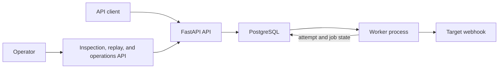

# Reliable Webhook Delivery Service

A PostgreSQL-backed FastAPI service for durable webhook ingestion, asynchronous delivery,
deterministic retries, replay, and operational inspection.

## TL;DR

- Ingests webhook events durably with an optional endpoint-scoped `Idempotency-Key` and atomically
  creates each new event with its initial PostgreSQL-backed delivery job.
- Runs the API and worker as separate processes. The worker claims due jobs, records event-wide
  attempt history, applies deterministic exponential backoff, recovers stale work, and moves
  exhausted jobs to `dead_letter`.
- Supports synchronous manual delivery, asynchronous terminal replay with a fresh automatic retry
  budget, read-only job inspection, liveness, PostgreSQL readiness, and an aggregate queue summary.
- Makes transaction and concurrency boundaries explicit. Delivery is effectively at-least-once,
  not exactly-once.

## Capabilities

### Ingestion and persistence

- Endpoint configuration and durable JSON webhook event ingestion.
- Endpoint-scoped idempotency with equivalent-request reuse and conflict detection.
- Atomic event and initial `pending` job persistence.

### Delivery and retry

- Separate worker delivery with persistent, event-wide attempt history.
- Deterministic retry decisions with bounded exponential backoff.
- Terminal `succeeded` and `dead_letter` states.

### Worker and recovery

- Explicitly started worker with bounded recovery and processing phases.
- Separate claim and per-job completion transactions with intentional partial progress.
- Stale-processing recovery and graceful shutdown.

### Replay and inspection

- Synchronous manual delivery without changing the delivery job.
- Asynchronous replay that resets the current automatic retry cycle and preserves global history.
- Read-only event-scoped inspection and cursor-based job listing.

### Operations and quality

- Dependency-free liveness, PostgreSQL readiness, and aggregate queue summary.
- Real PostgreSQL integration tests, Alembic validation, Ruff, strict mypy, and GitHub Actions CI.

Detailed behavior is documented in [Architecture](docs/architecture.md),
[Database and migrations](docs/database.md), [Delivery execution](docs/delivery-execution.md),
[Operational endpoints](docs/operations.md), and [API documentation](docs/api/index.md).

## Architecture


```mermaid
flowchart LR
    Client["API client"] --> API["FastAPI API"]
    Operator["Operator"] --> Operations["Inspection, replay, and operations API"]
    Operations --> API
    API --> PostgreSQL["PostgreSQL"]
    PostgreSQL --> Worker["Worker process"]
    Worker --> Target["Target webhook"]
    Worker -->|"attempt and job state"| PostgreSQL
```

The API stores durable work in PostgreSQL, which is the persistence and coordination boundary
between the API and worker processes. The worker claims due jobs, performs delivery, and atomically
records each completed attempt with the resulting job state. Operator routes inspect committed
state or explicitly reschedule an existing terminal job.

See [Architecture](docs/architecture.md) for focused flow and transaction diagrams.

## Quick start

Python 3.12 and Docker with Docker Compose are required.

```powershell
python -m venv .venv
.\.venv\Scripts\Activate.ps1
python -m pip install -e ".[dev]"
Copy-Item .env.example .env
docker compose up -d postgres
python -m alembic upgrade head
python -m uvicorn reliable_webhook_service.main:app --reload
```

The API is available at `http://127.0.0.1:8000`. See
[Development setup](docs/development.md) for configuration and port-conflict guidance.

## Run the API and worker

Run the API and worker in separate terminals:

```powershell
python -m uvicorn reliable_webhook_service.main:app --reload
python -m reliable_webhook_service.worker
```

FastAPI startup does not start or control the worker.

## API overview

| Method | Path | Purpose |
|---|---|---|
| GET | `/health` | Process liveness |
| GET | `/ready` | PostgreSQL readiness |
| GET | `/operations/summary` | Aggregate queue state |
| POST/GET | `/webhook-endpoints` | Endpoint management |
| POST | `/webhook-events` | Durable event ingestion |
| GET | `/webhook-events/{event_id}/delivery-job` | Inspect one job |
| GET | `/webhook-delivery-jobs` | List and filter jobs |
| GET/POST | `/webhook-events/{event_id}/delivery-attempts` | List or manually execute delivery |
| POST | `/webhook-events/{event_id}/replay` | Reschedule a terminal job |

See [API documentation](docs/api/index.md) for complete request, response, and error contracts.

## Guarantees and limitations

- Delivery is effectively at-least-once. An uncertain remote result can lead to duplicate
  downstream side effects; targets should implement idempotency or deduplication.
- The worker is a separately operated process. There is no distributed worker coordination,
  lease ownership, heartbeat, or automatic API-managed startup.
- Authentication and authorization are not built in. Deployments should restrict application and
  operator endpoints at the network or gateway boundary.
- Configured HTTP and HTTPS destination URLs are used for outbound delivery. Production delivery
  does not currently enforce an SSRF-safe DNS-to-connection boundary. The completed and reviewed
  [webhook destination security spike](docs/design/0057-webhook-ssrf-boundary-spike.md) is
  design-only; runtime enforcement is deferred to follow-up implementation.
- `/ready` checks PostgreSQL only. Operational endpoints do not check the worker, migration head,
  or downstream webhook targets, and their responses are point-in-time snapshots.

## Quality

```powershell
python -m pytest -W error
python -m ruff check .
python -m ruff format --check .
python -m mypy src
python -m alembic check
python scripts/validate_markdown.py
```

The full suite and Alembic checks require reachable PostgreSQL with current migrations.

## Documentation

| Document | Purpose |
|---|---|
| [Documentation portal](docs/index.md) | Reading order and common tasks |
| [Architecture](docs/architecture.md) | System flows, transaction boundaries, and source map |
| [Development setup](docs/development.md) | Local installation, configuration, API, and worker |
| [Database and migrations](docs/database.md) | PostgreSQL schema, Alembic, locking, and transactions |
| [Delivery execution](docs/delivery-execution.md) | Delivery, retry, recovery, replay, and worker behavior |
| [Operational endpoints](docs/operations.md) | Liveness, readiness, and aggregate queue inspection |
| [API documentation](docs/api/index.md) | Public HTTP API reference |
| [Webhook destination security spike](docs/design/0057-webhook-ssrf-boundary-spike.md) | Design-only SSRF boundary; runtime enforcement deferred |
| [Changelog](CHANGELOG.md) | Release history and important limitations |
