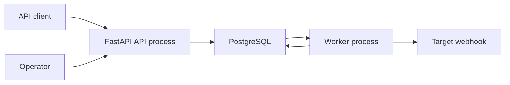
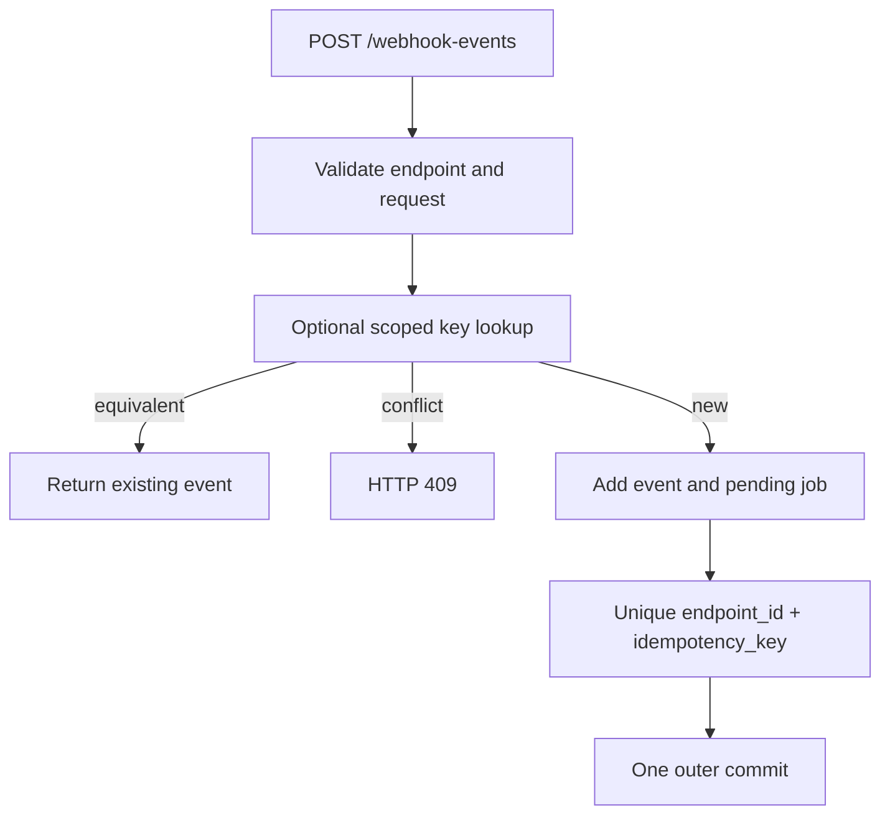
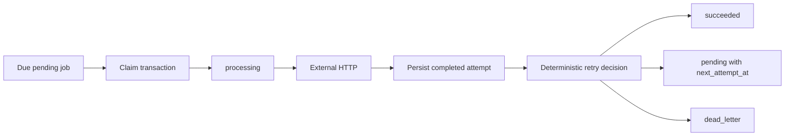
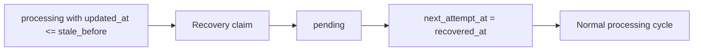
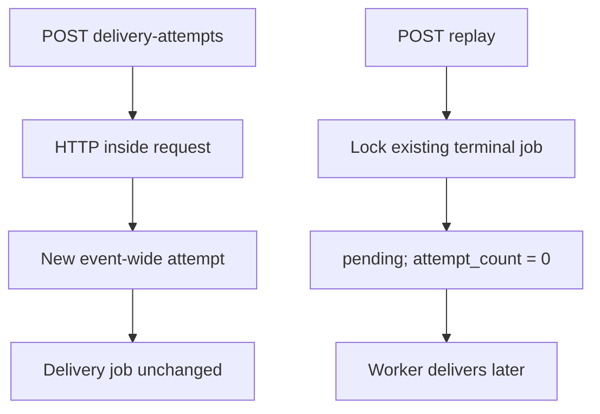
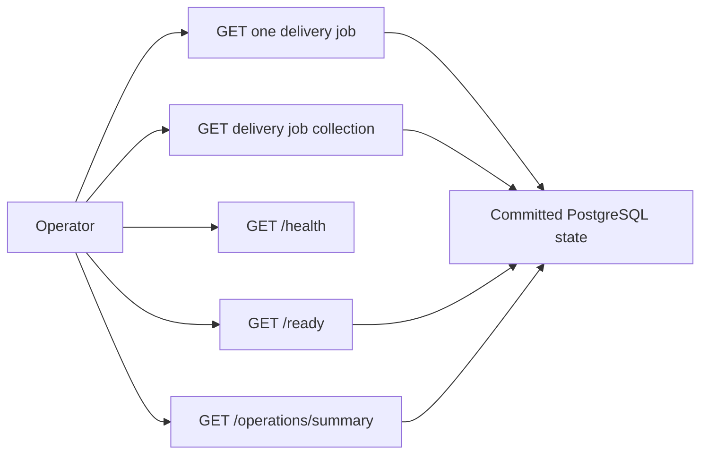

# Architecture

This document is the technical overview of the Reliable Webhook Delivery Service. Start here to
understand process boundaries, durable state, delivery semantics, and where each behavior lives in
the codebase.

## Table of contents

- [System context](#system-context)
- [Event ingestion and idempotency](#event-ingestion-and-idempotency)
- [Worker delivery and retry](#worker-delivery-and-retry)
- [Stale-processing recovery](#stale-processing-recovery)
- [Manual delivery and replay](#manual-delivery-and-replay)
- [Inspection and operations](#inspection-and-operations)
- [Transaction boundaries](#transaction-boundaries)
- [Guarantees and limitations](#guarantees-and-limitations)
- [Source map](#source-map)
- [Navigation](#navigation)

Arrows in the diagrams show control flow or durable state flow. A database arrow does not imply
that the surrounding operations share one transaction; the text below each diagram states the
actual boundary.

---

## System context

The API and worker are separate processes connected through durable PostgreSQL state. FastAPI
startup does not start the worker; an operator starts each process explicitly. The worker reads due
jobs and persists attempts and job transitions. PostgreSQL readiness does not check the target
webhook or worker process.

[Back to table of contents](#table-of-contents)

---

## Event ingestion and idempotency

The optional idempotency key is scoped by `(endpoint_id, idempotency_key)`. Equivalent reuse returns
the existing event; reuse with different event content is a conflict. A PostgreSQL unique
constraint is the concurrency authority when requests race.

For a new request, the event and initial `pending` delivery job are persisted atomically by one
outer transaction. The request does not perform downstream HTTP. See
[Database and migrations](database.md#atomic-event-and-delivery-job-creation) and
[Webhook event API](api/webhook-events.md).

Sources:

- [API routes](../src/reliable_webhook_service/api.py)
- [Event ingestion service](../src/reliable_webhook_service/event_service.py)
- [Database models](../src/reliable_webhook_service/models.py)

[Back to table of contents](#table-of-contents)

---

## Worker delivery and retry

The claim query uses PostgreSQL `FOR UPDATE SKIP LOCKED` with deterministic ordering. Its commit
finishes before external HTTP begins. The processing cycle then opens one completion transaction
per claimed job.

Within a completion transaction, the new `WebhookDeliveryAttempt` and resulting delivery job
transition are committed or rolled back together. Earlier job completions remain committed if a
later job fails, so bounded processing intentionally permits partial progress. Retry delays are
deterministic bounded exponential backoff. Delivery is not exactly-once.

See [Webhook delivery execution](delivery-execution.md) and
[Database and migrations](database.md#delivery-job-claiming).

Sources:

- [Job claiming](../src/reliable_webhook_service/delivery_job_service.py)
- [Bounded processing cycle](../src/reliable_webhook_service/delivery_processing_service.py)
- [Job completion](../src/reliable_webhook_service/delivery_job_execution_service.py)
- [Delivery execution](../src/reliable_webhook_service/delivery_service.py)
- [Retry policy](../src/reliable_webhook_service/retry_policy.py)
- [Worker iteration](../src/reliable_webhook_service/worker_iteration_service.py)
- [Worker loop](../src/reliable_webhook_service/worker_loop_service.py)

[Back to table of contents](#table-of-contents)

---

## Stale-processing recovery

Recovery eligibility is inclusive: production recovery selects `processing` jobs with
`updated_at <= stale_before`. This differs intentionally from the operational summary's exclusive
stale count boundary.

One worker iteration commits its bounded recovery transaction before starting the separate
processing cycle. A recovered job is scheduled at `recovered_at` and can therefore be eligible in
the same iteration. Recovery creates no delivery attempt and performs no HTTP.

See [Stale processing job recovery](delivery-execution.md#stale-processing-job-recovery) and
[Database recovery semantics](database.md#stale-processing-job-recovery).

Source: [Recovery service](../src/reliable_webhook_service/delivery_job_recovery_service.py).

[Back to table of contents](#table-of-contents)

---

## Manual delivery and replay

Synchronous manual delivery and asynchronous terminal replay are different operations. Manual
delivery performs HTTP during the API request and appends a globally numbered attempt without
changing the delivery job. `WebhookDeliveryAttempt.attempt_number` remains monotonic across the
event's complete history.

Replay performs no HTTP and creates no attempt. It locks the existing `succeeded` or `dead_letter`
job, resets `WebhookDeliveryJob.attempt_count` for the new automatic retry cycle, and schedules the
worker to deliver later. Replay is not ingestion idempotency and can produce duplicate downstream
side effects when an earlier remote outcome was uncertain.

See [Webhook event replay](api/webhook-events.md#manual-replay),
[Webhook delivery attempt API](api/webhook-delivery-attempts.md), and
[Delivery execution](delivery-execution.md#manual-replay-and-retry-cycle-budget).

Sources:

- [Replay service](../src/reliable_webhook_service/replay_service.py)
- [Delivery service](../src/reliable_webhook_service/delivery_service.py)

[Back to table of contents](#table-of-contents)

---

## Inspection and operations

Job inspection is read-only, uses no row locks, and returns committed snapshots. Collection
pagination is deterministic keyset pagination with an opaque cursor. `/health` is dependency-free
liveness, `/ready` runs one minimal PostgreSQL query, and `/operations/summary` executes one
conditional aggregate statement.

These GET endpoints do not start the worker, claim or recover jobs, replay events, or contact target
webhooks. Results can become stale immediately after the response because concurrent transactions
continue normally.

See [Operational endpoints](operations.md) and
[Webhook delivery job API](api/webhook-delivery-jobs.md).

Sources:

- [Operations API](../src/reliable_webhook_service/operations_api.py)
- [Operations service](../src/reliable_webhook_service/operations_service.py)
- [Job query service](../src/reliable_webhook_service/delivery_job_query_service.py)

[Back to table of contents](#table-of-contents)

---

## Transaction boundaries

| Flow | Transaction boundary |
|---|---|
| Event ingestion | Event and initial job share one API-owned outer transaction |
| Idempotency race | A savepoint contains the keyed insert race; the outer transaction remains authoritative |
| Job claim | One dedicated transaction commits before external HTTP |
| Job completion | One transaction per job persists the attempt and job transition together |
| Worker iteration | Recovery commits before processing; no iteration-wide transaction exists |
| Manual delivery | The API commits one new attempt; the job is unchanged |
| Replay | The API locks and reschedules the existing terminal job in one transaction |
| Inspection and operations | Read-only dependency-owned sessions; no explicit commit or row lock |

External HTTP cannot participate in the PostgreSQL transaction. A request may reach a target even
when local completion later rolls back.

[Back to table of contents](#table-of-contents)

---

## Guarantees and limitations

- PostgreSQL is the durability and concurrency authority for local event, job, and attempt state.
- Event ingestion with a new request atomically persists the event and its initial job.
- Completed worker attempts and their corresponding job transitions are atomic locally.
- Delivery is effectively at-least-once; uncertain external outcomes can be delivered again.
- Downstream systems should implement idempotency or deduplication.
- The service has no built-in authentication or authorization.
- There is no distributed worker coordination, lease ownership, or worker heartbeat.
- Operational responses are point-in-time observations, not durable scheduling decisions.

[Back to table of contents](#table-of-contents)

---

## Source map

| Area | Source |
|---|---|
| Application setup | [main.py](../src/reliable_webhook_service/main.py) |
| API routes | [api.py](../src/reliable_webhook_service/api.py) |
| Event ingestion | [event_service.py](../src/reliable_webhook_service/event_service.py) |
| Delivery execution | [delivery_service.py](../src/reliable_webhook_service/delivery_service.py) |
| Job claiming | [delivery_job_service.py](../src/reliable_webhook_service/delivery_job_service.py) |
| Bounded processing | [delivery_processing_service.py](../src/reliable_webhook_service/delivery_processing_service.py) |
| Job completion | [delivery_job_execution_service.py](../src/reliable_webhook_service/delivery_job_execution_service.py) |
| Retry policy | [retry_policy.py](../src/reliable_webhook_service/retry_policy.py) |
| Recovery | [delivery_job_recovery_service.py](../src/reliable_webhook_service/delivery_job_recovery_service.py) |
| Worker iteration | [worker_iteration_service.py](../src/reliable_webhook_service/worker_iteration_service.py) |
| Worker loop | [worker_loop_service.py](../src/reliable_webhook_service/worker_loop_service.py) |
| Worker process | [worker.py](../src/reliable_webhook_service/worker.py) |
| Replay | [replay_service.py](../src/reliable_webhook_service/replay_service.py) |
| Inspection | [delivery_job_query_service.py](../src/reliable_webhook_service/delivery_job_query_service.py) |
| Operations | [operations_service.py](../src/reliable_webhook_service/operations_service.py) |
| Database models | [models.py](../src/reliable_webhook_service/models.py) |
| Schemas | [schemas.py](../src/reliable_webhook_service/schemas.py) |
| Configuration | [config.py](../src/reliable_webhook_service/config.py) |

[Back to table of contents](#table-of-contents)

---

## Navigation

- [Documentation portal](index.md)
- [Development setup](development.md)
- [Database and migrations](database.md)
- [Webhook delivery execution](delivery-execution.md)
- [Operational endpoints](operations.md)
- [API documentation](api/index.md)
- [Changelog](../CHANGELOG.md)
- [Project README](../README.md)
