# Architecture

Reliable delivery in this project is a sequence of short PostgreSQL transactions
around an HTTP call that cannot participate in those transactions. The diagrams
below show where state is owned, when it becomes durable, and which guarantees
stop at the process or network boundary.

## Contents

- [System context](#system-context)
- [Application component map](#application-component-map)
- [Persistent data model](#persistent-data-model)
- [Event ingestion and idempotency race](#event-ingestion-and-idempotency-race)
- [Worker process lifecycle](#worker-process-lifecycle)
- [Worker loop and one iteration](#worker-loop-and-one-iteration)
- [Claim and per-job completion transactions](#claim-and-per-job-completion-transactions)
- [Delivery and retry state machine](#delivery-and-retry-state-machine)
- [Stale-processing recovery](#stale-processing-recovery)
- [Manual delivery and replay](#manual-delivery-and-replay)
- [Inspection and operations](#inspection-and-operations)
- [Transaction boundaries](#transaction-boundaries)
- [Guarantees and limitations](#guarantees-and-limitations)
- [Source map](#source-map)
- [Navigation](#navigation)

---

## System context

The API accepts configuration and events, while a separate worker performs
delivery. PostgreSQL is the hand-off point between those processes and the
durable record of every accepted event, queued job, and completed attempt.

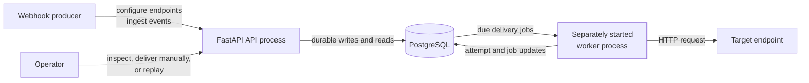

The target can observe a request before the worker commits its result. This is
why the service records at-least-once delivery history rather than claiming
exactly-once delivery.

Relevant entry points are
[`main.py`](../src/reliable_webhook_service/main.py) and
[`worker.py`](../src/reliable_webhook_service/worker.py).

---

## Application component map

Both processes share settings, SQLAlchemy models, database primitives, and the
delivery services. Process entry points own long-lived resources; routes and
service functions receive the resources they use.

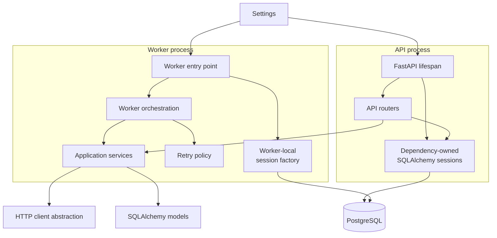

The API lifespan creates one raw HTTP client for manual delivery requests, and
the service layer wraps it behind the same abstraction used by the worker.
The worker creates its own engine, session factory, shutdown event, and HTTP
client, then closes or disposes all of them during process cleanup. ORM models
describe persisted state; sessions, rather than model objects, communicate with
PostgreSQL. The code behind these boundaries lives in
[`dependencies.py`](../src/reliable_webhook_service/dependencies.py),
[`database.py`](../src/reliable_webhook_service/database.py), and
[`delivery_http.py`](../src/reliable_webhook_service/delivery_http.py).

---

## Persistent data model

The schema keeps delivery scheduling and delivery history separate. A job is
mutable scheduling state for one event; attempts are an append-only history of
completed delivery calls.

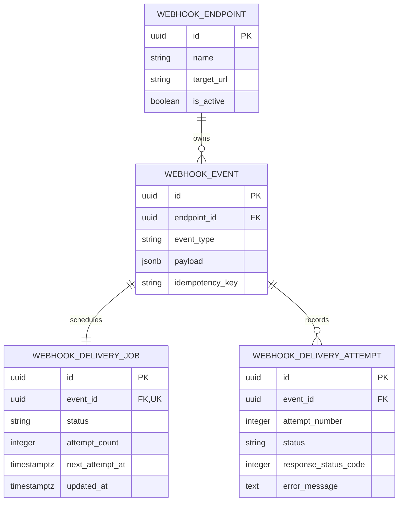

Important constraints are:

- `(endpoint_id, idempotency_key)` is unique for keyed events;
- `event_id` is unique in `webhook_delivery_jobs`, so an event has one current
  job;
- `(event_id, attempt_number)` is unique in the attempt history;
- job status, non-negative cycle attempt count, and attempt result fields are
  constrained in PostgreSQL.

These are database relationships, not ORM object relationships. The model does
not use `relationship()` collections. See
[`models.py`](../src/reliable_webhook_service/models.py) and the
[database schema](database.md#database-schema) guide for the executable model
and migration definitions.

[Back to contents](#contents)

---

## Event ingestion and idempotency race

Event ingestion creates the event and its initial pending job in one
caller-owned transaction. A key is scoped to an endpoint, and equivalent use of
the same key returns the existing event.

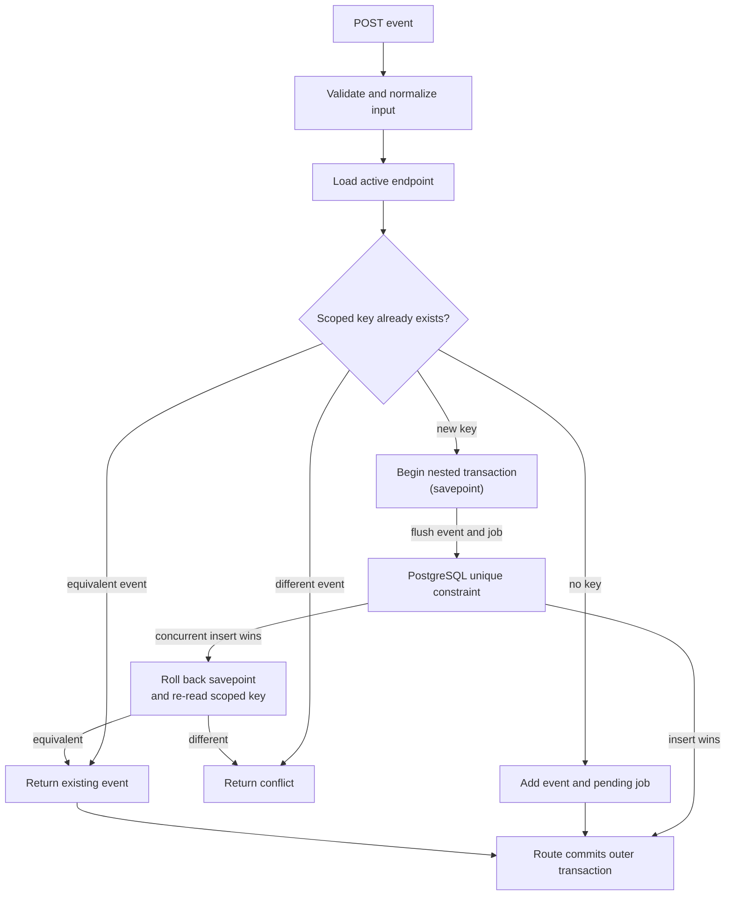

Only the expected uniqueness violation is treated as an idempotency race.
Other integrity errors still propagate. The nested transaction protects the
outer request transaction so the winner can be re-read without discarding
unrelated caller-owned work. Ingestion does not perform target HTTP.

Implementation: [`event_service.py`](../src/reliable_webhook_service/event_service.py)
and [`api.py`](../src/reliable_webhook_service/api.py).

---

## Worker process lifecycle

The worker entry point owns resources that must live for the whole process. It
installs signal handlers around the loop and cleans up even when an ordinary
fatal error escapes.

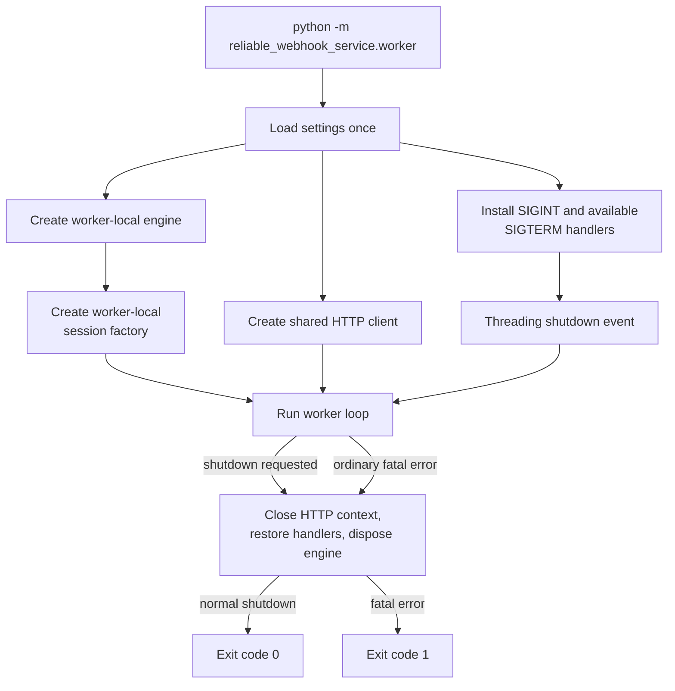

`SIGINT` is always handled. `SIGTERM` is registered only when the platform
exposes it. Cleanup errors are reported without replacing an already known loop
failure. The lifecycle is implemented in
[`worker.py`](../src/reliable_webhook_service/worker.py).

---

## Worker loop and one iteration

The first iteration starts immediately. A single UTC timestamp anchors recovery
and claiming, which prevents time from drifting between the two phases of the
same iteration.

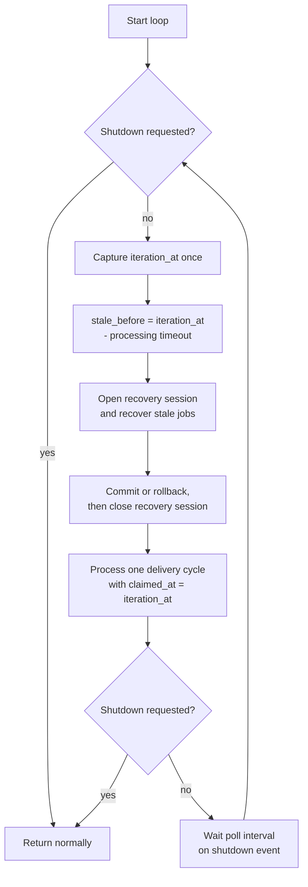

Recovery must commit and close before claiming begins. If recovery fails,
processing is not attempted. A processing failure also escapes the loop; there
is no in-process retry around a failed iteration.

The loop and iteration split is visible in
[`worker_loop_service.py`](../src/reliable_webhook_service/worker_loop_service.py)
and
[`worker_iteration_service.py`](../src/reliable_webhook_service/worker_iteration_service.py).

[Back to contents](#contents)

---

## Claim and per-job completion transactions

Claiming is deliberately separated from network delivery. The claim
transaction is short and releases row locks before any request is sent.
Each claimed UUID is then completed in its own fresh session and transaction.

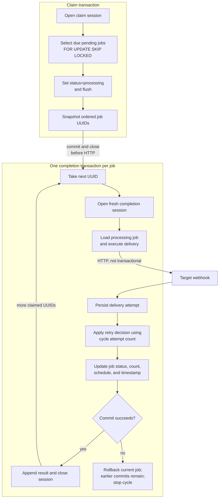

The claim query is bounded, deterministic, and uses `SKIP LOCKED`, so concurrent
workers can claim different rows. Earlier per-job commits remain durable if a
later claimed job fails. The current job's attempt and state transition roll
back together, although the remote target may already have observed the HTTP
request.

The boundaries are enforced by
[`delivery_processing_service.py`](../src/reliable_webhook_service/delivery_processing_service.py),
[`delivery_job_service.py`](../src/reliable_webhook_service/delivery_job_service.py),
and
[`delivery_job_execution_service.py`](../src/reliable_webhook_service/delivery_job_execution_service.py).

---

## Delivery and retry state machine

A delivery job moves through four states. The worker claims only due `pending`
jobs. Delivery success is any HTTP 2xx response; other completed calls are
failed attempts evaluated by the retry policy.

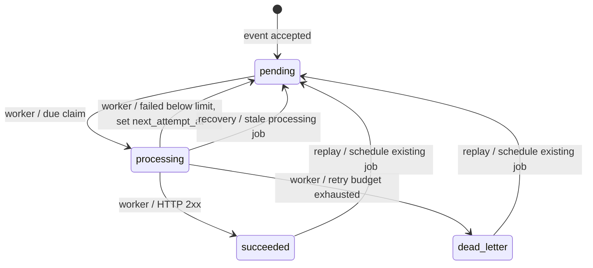

`WebhookDeliveryAttempt.attempt_number` is global across the event's entire
history. `WebhookDeliveryJob.attempt_count` counts automatic worker attempts in
the current retry cycle. Manual delivery can advance the global number without
advancing the cycle count; replay resets the cycle count to zero.

For a failed worker call, the retry decision receives
`job.attempt_count + 1`. Backoff is deterministic, exponential, and bounded.
The relevant code is
[`delivery_service.py`](../src/reliable_webhook_service/delivery_service.py),
[`delivery_job_execution_service.py`](../src/reliable_webhook_service/delivery_job_execution_service.py),
and [`retry_policy.py`](../src/reliable_webhook_service/retry_policy.py).

---

## Stale-processing recovery

A worker can disappear after committing a claim. Recovery makes such jobs
eligible again without inventing a delivery attempt.

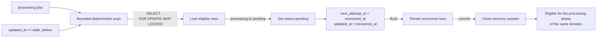

The recovery boundary is inclusive (`updated_at <= stale_before`). The
operational stale count uses an exclusive boundary (`updated_at <
stale_processing_before`), so it is a monitoring snapshot rather than the
recovery query itself. Recovery does not call the target, create an attempt, or
change the current cycle attempt count.

Code: [`delivery_job_recovery_service.py`](../src/reliable_webhook_service/delivery_job_recovery_service.py).

[Back to contents](#contents)

---

## Manual delivery and replay

Manual delivery and replay are separate operations. One performs HTTP now and
adds to history; the other only resets terminal scheduling state for the worker.

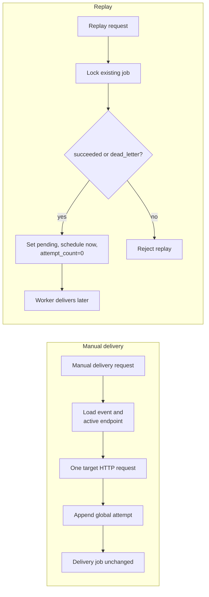

Both operations use caller-owned database transactions. Manual delivery can
succeed or fail independently of the delivery job state. Replay creates neither
an HTTP request nor an attempt; it reuses the one existing job for the event.
Use manual delivery when the request must happen synchronously, and replay when
the worker should own a new automatic retry cycle.

See [`delivery_service.py`](../src/reliable_webhook_service/delivery_service.py),
[`replay_service.py`](../src/reliable_webhook_service/replay_service.py), and
[`api.py`](../src/reliable_webhook_service/api.py).

---

## Inspection and operations

Inspection endpoints read durable state without changing it. They are separate
from the worker control path and do not contact webhook targets.

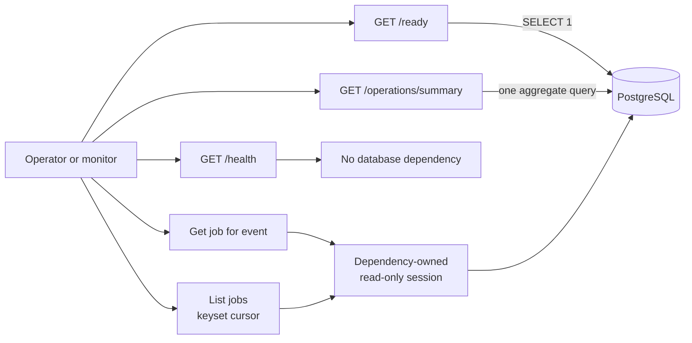

Job collection order is `updated_at DESC, id DESC`; its opaque cursor carries
that keyset boundary. The operations summary counts states and reports due and
stale timing data from one generated timestamp. A response is a snapshot and
can become stale immediately after it is returned. These reads do not lock job
rows, start a worker, contact a target, or trigger recovery, delivery, or replay.

Inspect
[`delivery_job_query_service.py`](../src/reliable_webhook_service/delivery_job_query_service.py),
[`operations_service.py`](../src/reliable_webhook_service/operations_service.py),
and [`operations_api.py`](../src/reliable_webhook_service/operations_api.py)
for the exact query contracts.

---

## Transaction boundaries

The session owner also owns commit and rollback. Service functions flush when
they need database-generated state or early constraint evaluation, but they do
not commit a caller's transaction.

| Operation | Session owner | Durable boundary |
| --- | --- | --- |
| Event ingestion | API dependency and route | Event and initial job commit together |
| Manual delivery | API dependency and route | Attempt commits with the request transaction |
| Replay | API dependency and route | Locked job reset commits with the request transaction |
| Stale recovery | Worker iteration | Recovery batch commits before claiming starts |
| Claim due jobs | Delivery-cycle coordinator | All selected jobs become `processing` in one short transaction |
| Complete one claimed job | Delivery-cycle coordinator | Attempt and job transition commit together for that UUID |
| Inspection and operations | API dependency | Read-only transaction ends when the dependency closes |

`get_session()` rolls back exceptions propagated by routes. Worker coordinators
explicitly commit, roll back, and close their worker-local sessions. No
transaction spans both claiming and outbound HTTP.

---

## Guarantees and limitations

What the design guarantees:

- accepted events and their initial jobs are created atomically;
- a keyed event is idempotent within its endpoint, including the expected
  concurrent insert race;
- job claiming is bounded and safe for concurrent workers through row locks and
  `SKIP LOCKED`;
- a completed worker attempt and its job transition share one transaction;
- stale claims can return to the pending queue;
- retry scheduling is deterministic from the worker cycle attempt number;
- persisted attempts retain event-wide chronological numbering.

What it intentionally does not guarantee:

- exactly-once delivery to an external target;
- rollback of a request already observed by the target;
- proof that a stale job did not reach the target before its worker disappeared;
  recovery can therefore cause a duplicate downstream delivery;
- exactly-once recovery through replay; replay schedules another worker cycle;
- successful continuation after an iteration-level worker failure;
- automatic process supervision or restart;
- outbound request cancellation merely because a shutdown signal arrived;
- delivery ordering across different events or workers;
- a durable transaction that also covers remote side effects; PostgreSQL
  coordinates local state only.

The practical duplicate window is between the target observing an HTTP request
and PostgreSQL committing the corresponding attempt. Target systems should
therefore treat webhook consumption as idempotent.

---

## Source map

Use this map to move from a diagram to the implementation:

| Concern | Primary modules |
| --- | --- |
| API composition and resource lifetime | [`main.py`](../src/reliable_webhook_service/main.py), [`dependencies.py`](../src/reliable_webhook_service/dependencies.py) |
| Configuration and database primitives | [`config.py`](../src/reliable_webhook_service/config.py), [`database.py`](../src/reliable_webhook_service/database.py) |
| Persistent model | [`models.py`](../src/reliable_webhook_service/models.py), [database schema](database.md#database-schema) |
| Event ingestion | [`api.py`](../src/reliable_webhook_service/api.py), [`event_service.py`](../src/reliable_webhook_service/event_service.py) |
| Delivery and retry | [`delivery_service.py`](../src/reliable_webhook_service/delivery_service.py), [`delivery_job_execution_service.py`](../src/reliable_webhook_service/delivery_job_execution_service.py), [`retry_policy.py`](../src/reliable_webhook_service/retry_policy.py) |
| Worker lifecycle and loop | [`worker.py`](../src/reliable_webhook_service/worker.py), [`worker_loop_service.py`](../src/reliable_webhook_service/worker_loop_service.py), [`worker_iteration_service.py`](../src/reliable_webhook_service/worker_iteration_service.py) |
| Claiming and completion | [`delivery_job_service.py`](../src/reliable_webhook_service/delivery_job_service.py), [`delivery_processing_service.py`](../src/reliable_webhook_service/delivery_processing_service.py) |
| Recovery | [`delivery_job_recovery_service.py`](../src/reliable_webhook_service/delivery_job_recovery_service.py) |
| Manual delivery and replay | [`api.py`](../src/reliable_webhook_service/api.py), [`delivery_service.py`](../src/reliable_webhook_service/delivery_service.py), [`replay_service.py`](../src/reliable_webhook_service/replay_service.py) |
| Inspection and operations | [`delivery_job_query_service.py`](../src/reliable_webhook_service/delivery_job_query_service.py), [`operations_service.py`](../src/reliable_webhook_service/operations_service.py), [`operations_api.py`](../src/reliable_webhook_service/operations_api.py) |

---

## Navigation

- [Documentation portal](index.md)
- [API documentation](api/index.md)
- [Database and migrations](database.md)
- [Development setup](development.md)
- [Project README](../README.md)
